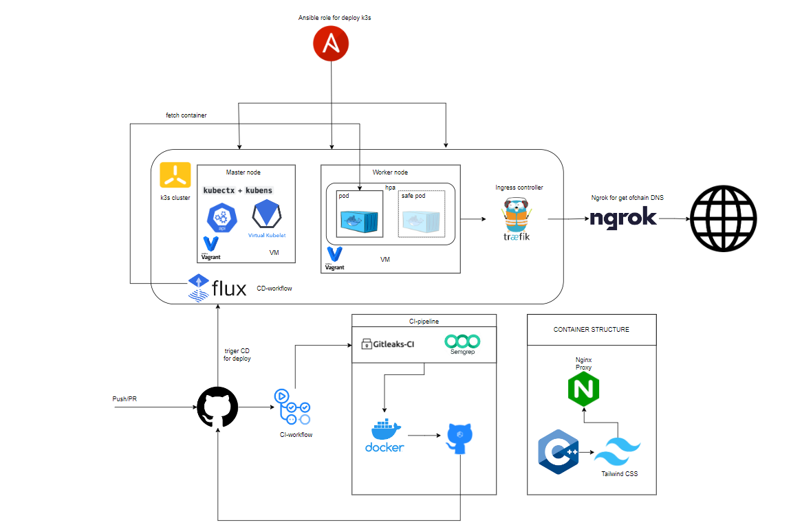
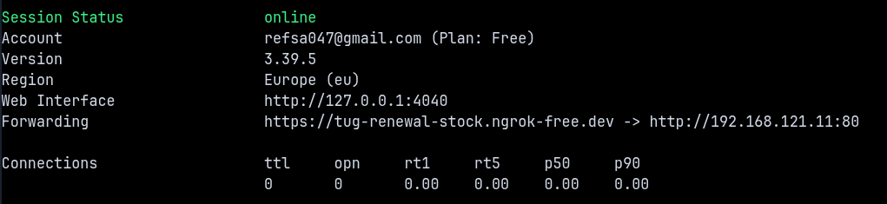

### ТЗ: реализовать полный цикл деплоя и поддержки ПО (SRE) на уровне прода реальной компании (prod-like)



#### Основной функционал:
- Пользователь получает возможность полного управления реальным k8s (k3s) кластером и управлением рессурсов
- Настроены CI/CD piplines для полного цикла DevSecOps
- Сам кластер деплоется Ansible ролью, которая ыетчит дефолтные TLS ключи и позволяет управлять кластером с хоста как с мастер ноды

#### Структура проекта:
- /src - сурсы контейнера, место в котором ведется разработка
- /Vagrant-k3s-cluster - общая дира для Vagrant VM и k3s
- /Vagrant-k3s-cluster/ansible - ansible роль для авто раскатки кластера
- /.github - все CI пайплайны для Github Actions
- /FluxCD - манифесты для Image Updater в FluxCD
- /k3s-manifest - манифесты деплоя в k3s

#### Стек технологий
- `nginx` - HTTP frontend внутри контейнера
- `Docker` - сборка и упаковка приложения
- `Kubernetes (k3s)` - целевая платформа деплоя
- `Traefik Ingress` - входной трафик в кластер
- `HorizontalPodAutoscaler` - автоскейлинг по CPU
- `Ansible` - автоматическая раскатка кластера и kubeconfig
- `Vagrant` + `libvirt` - локальный prod-like стенд на VM

#### Темы курса
- DevOps/CI-CD/VM and Docker/Deploy

#### Входные и выходные данные
- На фход полного workflow ползователь подает свои изменения в репозитории
- На выход получаем деплой контейнера в production кластер

#### Роли участников

Группа: СКБ251

- Ручкин Иван - DevSecOps + SRE + CloudeSec

- Ганиева Милана - UX/UX Layout Designer

- Яблоков Николай - С++ backend dev

---

## Fast Start

### 1. Поднимаем виртуалки

```bash
cd ~/Projects-git/Metric2Deploy/Vagrant-k3s-cluster
vagrant up --provider=libvirt
vagrant status
```

### 2. Раскатывает k3s и тянем kubeconfig через Ansible-роль

```bash
ansible-playbook -i ansible/inventory.ini ansible/k3s-claster.yml -v
```

### 3. Сетапим саб-конфиг в глобальный KUBECONFIG через kubectx

```bash
unset KUBECONFIG
kubectl config get-contexts
kubectx metric2deploy
kubectl config set-context --current --namespace=default
```

### 4. Деплой манифестов в кластер

```bash 
kubectl apply -f k3s-manifest/
```
> Если используется KUBECONFIG проекта: `KUBECONFIG=~/.kube/metric2deploy.yaml kubectl apply -f k3s-manifest/`

### 5. Установка FluxCD и деплой манифестов

```bash
flux install
kubectl apply -f FluxCD/
kubectl get gitrepository,kustomization -n flux-system
```

### 6. Поднимаем ngrok тунель

```bash
ngrok http 192.168.121.11:80
```



